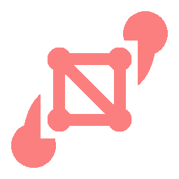
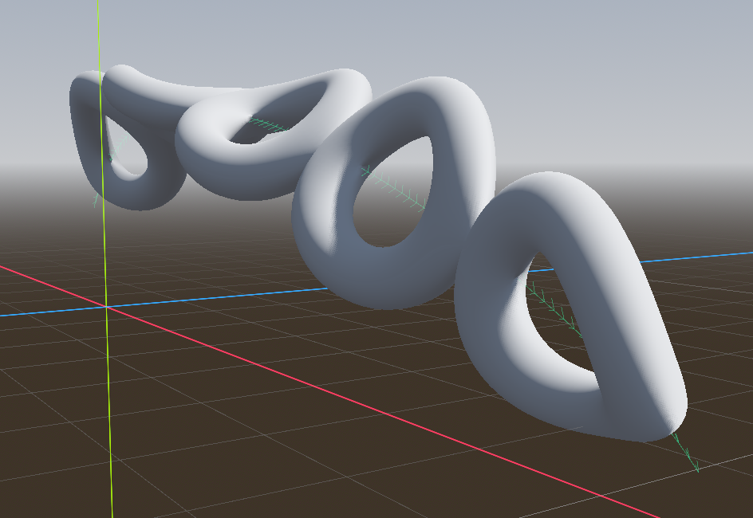
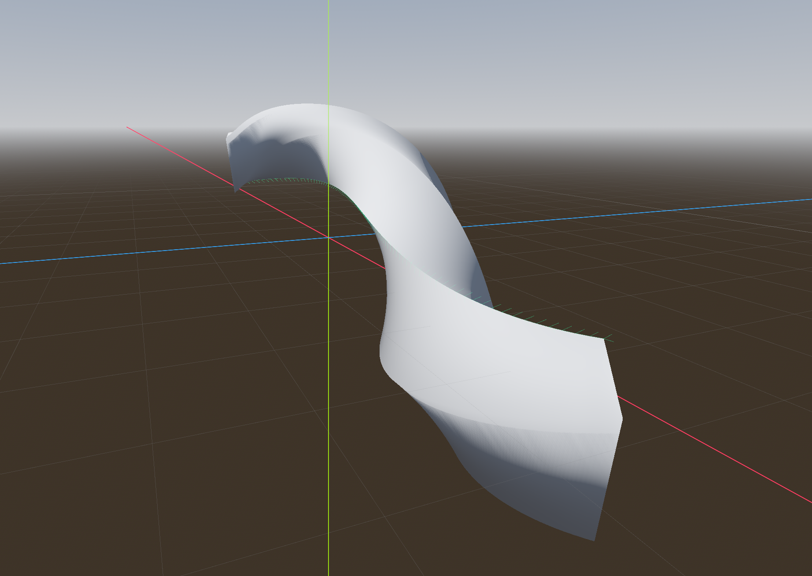
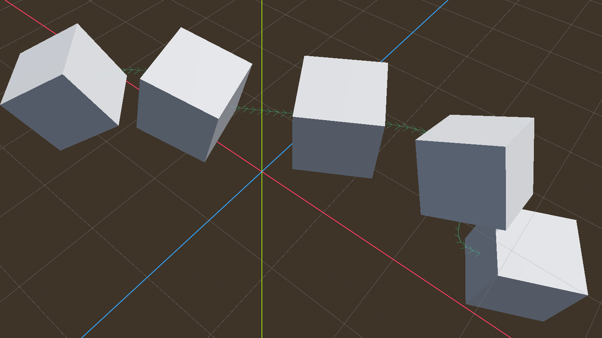

#  PathMesh3D
 A set of simple Godot 3D nodes for extruding and instancing 3D meshes along a Path3D.  Implemented as a GDExtension in C++ for speed.

 ## Download
 ### From Godot Asset Library in the Editor
 Click the `AssetLib` button at the top of the Godot editor and search for `PathMesh3D`.  From there, you can download it directly into your project.  You only need the [addons][addons] folder for the extension to work.

 ### From Godot Asset Library Web
 Head over to [the PathMesh3D page on the asset library website](https://godotengine.org/asset-library/asset) and click the download button.

 ### From GitHub.com
 You can download the full repository for PathMesh3D [here](https://github.com/iiMidknightii/PathMesh3D).  You can clone this repository by doing `git clone https://github.com/iiMidknightii/PathMesh3D.git` in the directory of your choosing.  If you want to compile your own binaries this is the best option.

 ## Installation
 Once you have the files downloaded, there are a couple paths you could take for installation.  The [addons/PathMesh3D](addons/PathMesh3D/) folder can be directly copied into your project.  It already has the binaries for debug and release builds on Windows and Linux.
 
 If you wish to build the binaries from source, you'd need to also copy the [src](./src/), [doc_classes](./doc_classes/), and [godot-cpp](./godot-cpp/) folders along with the [SConstruct](./Sconstruct) file.  [This page will tell you how to build the extension from source using the `scons` command](https://docs.godotengine.org/en/stable/tutorials/scripting/gdextension/gdextension_cpp_example.html).

The actual GDExtension classes are in the [addons/PathMesh3D/bin](addons/PathMesh3D/bin) binaries and are added to Godot via [addons/PathMesh3D/ez_pid.gdextension](addons/PathMesh3D/ez_pid.gdextension).

## Tutorial
### PathMesh3D
`PathMesh3D` is a great node if you want to take a 3D model and "tile" or "repeat" it along a `Path3D` node within your scene.  The `Mesh` model provided will be duplicated along its Z axis according to the settings chosen for each surface.  Since each surface has its own independent settings, there is a high degree of customization available.

Simply add the `PathMesh3D` node to the scene, set its `path_3d` property to a `Path3D` node, and set its `mesh` property to any `Mesh` derived resource.  From there, you can tweak the settings for each surface to get your desired effect.

### PathExtrude3D
`PathExtrude3D` works similarly to the `CSGPolygon` node when in path mode.  First, define the cross section of the mesh that will be extruded in the `cross_section` property.  This property stores the points as a `PackedVector2Array`.  Then, set the `path_3d` property to any `Path3D` node in the scene.  From there, the cross section will be extruded according to the settings you have chosen.

### PathMultiMesh3D
`PathMultiMesh3D` works similarly to `PathMesh3D`, but instead of creating one combined mesh, it generates the instances of a `MultiMesh` resource along the path.  Just set the `mesh` property to a `MultiMesh` (and select a base mesh for it).  Then, set the `path_3d` property to a `Path3D` node in the scene.  The node will automatically set the `MultiMesh` `instance_count` property and distribute their transforms along the path according to the selected settings.

## Tagged Releases
* 1.0 - intial release, targets godot-4.3

## Contributing
Feel free to leave any feedback, bug reports, and contributions to the repository at [https://github.com/iiMidknightii/PathMesh3D](https://github.com/iiMidknightii/PathMesh3D).